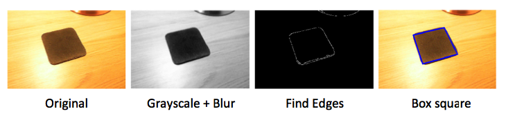
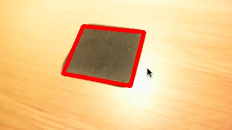
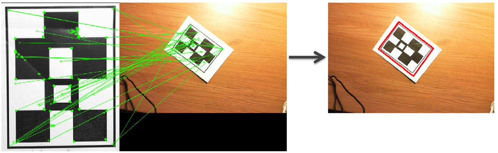

### Augmented Reality

Augmented reality (AR) is a technology that superimposes computer-generated images on a view of the real world. Unlike virtual reality (VR) which requires the user to inhabit a fully virtual world, AR augments (enhances) the existing environment.

#### Launching a new Environment
The following command will launch an environment with the relevant dependencies:
```
conda env create -f environment.yml -n aug
```
Once created the new environment can be activated and deactivated using the following commands:
```
source activate aug
pip install opencv-python==3.3.0.10
pip install opencv-contrib-python==3.3.0.10
```
The final command will launch a new intsance of iPython Notebooks in the environment:
```
jupyter notebook
```
To close or remove the environment (after deactivation) run the following:
```
source deactivate
conda env remove -n aug
```

#### Analysis

Our analysis starts by demonstrating the image transformations required to apply a bounding box to squares found within an image. These stages are shown in the following image:


This technique is further applied to a webcam video, with an example output shown below:


Having now provided some of the basics the analysis moves into a technique called Marker Based Augmented Reality (Image Recognition) where a visual marker in the real world is used to overlay the additional data. We show an example of this feature matching below:


Again we can apply this technique to a webcam video in order to render a bounding box in real time:


The final stage of our analysis is to render a 3D object onto our marker based bounding box and create our Augmented Reality view. The output of this is shown below:
